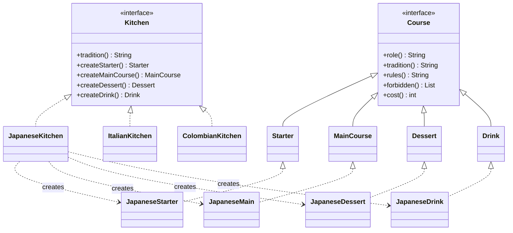

# Catering — Abstract Factory driven by an AI agent

A catering service where you talk to a waiter, it decides which kitchen to cook
from, and the chef builds a four-course combo. The **factory** guarantees the four
dishes belong to one culinary tradition; the **program** prices the combo by adding
up the pantry; the **agent** does everything a person used to do in between.

Plain Java 21, no libraries. `java.net.http` and `com.sun.net.httpserver` ship
with the JDK.

```
javac *.java
java Main                     # ollama, gemma4:31b-cloud
java Main --agent=offline     # no network, for presenting without internet
java Main --model=llama3.2    # any other ollama model
```

Opens on <http://localhost:8081>.

---

## The pattern

Each culinary tradition is a family of products that cannot be mixed. A japanese
starter with an italian dessert and a panela lemonade is not a combo, it is an
accident.



Three concrete factories, four abstract products, twelve concrete products.
`Kitchens.java` is the only place in the program where a `new XKitchen()`
appears — adding a fourth cuisine means writing its five classes and one line in
that list. The agent, the combo and the server never find out.

**The counter-example is a button in the interface.** It builds a combo by hand
with `new`, out of three different kitchens. It compiles and runs:

```
JapaneseStarter → japanese
ItalianMain     → italian
JapaneseDessert → japanese
ColombianDrink  → colombian
```

What prevents that everywhere else is not a validation. It is that without the
factory there is no way to create a dish.

---

## The agent

Two roles over one interface. `Agent` is only the model's mouth — `ask(prompt)`
and nothing else — so ollama can be swapped for the offline agent without either
role noticing.

| | |
|---|---|
| **Waiter** | The only one that talks to the client. Builds the order, picks the kitchen, negotiates. Never quotes prices. |
| **Chef** | Talks to nobody. Takes the order and builds against the factory and the pantry. |

### It is not a chatbot

1. **The waiter picks one action out of a closed set** — `ASK`, `BUILD`,
   `ADJUST`, `REFUSE` — and the program runs it. Anything else and the turn is
   rejected. It does not answer questions; it decides what the system does.

2. **The price never comes from the model.** `Pantry` is a singleton holding
   ingredients and their price, and the combo is quoted by adding it up. A
   chatbot would say *"that runs you about two hundred thousand"*; this
   instantiates the combo and quotes it. The prompt forbids the model from
   giving prices at all.

3. **The program overrules the model.** If the waiter wants to `BUILD` without
   knowing how many diners there are, `Conversation` downgrades it to `ASK`. If
   it names a kitchen that does not exist, `Kitchens.byTradition` fails loudly
   rather than assembling something broken.

### The loop

The chef proposes a dish and the **program** validates it. Five checks the model
cannot perform on itself:

- the format came back (`NAME` and `INGREDIENTS` lines)
- every ingredient is stocked in the pantry
- nothing on the family's `forbidden()` list was used
- the dish is under its price ceiling
- the protein is not repeated from another course of the combo

When a check fails, the written reason goes back to the model, and **that reason
is literally the string that goes into the retry's prompt**. Three attempts, then
it gives up and keeps the *cheapest* attempt — not the last one, which can be
worse than the first.

```
no|Main|1|Donburi with sake  -- you already used sake in another dish, change it
ok|Main|2|Tofu and shiitake donburi with miso ($9800)
```

With a tight budget the model walks the price down on its own, because the
rejection tells it the number: `$13900 → $8400 → $5500`.

### The global constraint

The whole combo has to fit the budget per person. When it does not, the chef goes
back over the priciest dish **already cooked** and rebuilds it cheaper. That is
what stops the agent from being linear: it revisits finished work.

---

## A real session

```
you    · six of us, project wrap dinner, something light
waiter · ASK    "What is your budget per person for this dinner?"
you    · about 60000 per person
waiter · BUILD  japanese · $43.000 per person
                Starter  JapaneseStarter  $12800  Tuna and Cucumber Sunomono
                Main     JapaneseMain     $15200  Steamed Salmon Soba Bowl
                Dessert  JapaneseDessert   $6900  Matcha Red Bean Mochi
                Drink    JapaneseDrink     $8100  Sake and Tea Pairing
you    · too expensive, and one of us does not eat fish
waiter · ADJUST japanese · $27.500 per person   (salmon and tuna → tofu)
```

---

## What showed up once a real model was wired in

The agent respects the **class** every time — the factory guarantees that and
there is no way around it — but it can leave the family through the **content**.
A `JapaneseDessert` is still japanese as far as the program is concerned even if
the model puts mascarpone in it. That is why every concrete product carries its
own `forbidden()`.

They are two different checks, and the interface shows them apart:
`sameFamily()` is guaranteed by the pattern, `violations()` is guaranteed by
nobody.

---

## Files

**The pattern**

| | |
|---|---|
| `Kitchen.java` | the abstract factory |
| `JapaneseKitchen` `ItalianKitchen` `ColombianKitchen` | the concrete factories |
| `Course` `AbstractCourse` | what every dish answers, and the shared bookkeeping |
| `Starter` `MainCourse` `Dessert` `Drink` | the four abstract products |
| `<Kitchen><Product>.java` | the twelve concrete products |
| `Kitchens.java` | the only `new XKitchen()` in the program |
| `Combo.java` | the four dishes of one kitchen, with their price |
| `Order.java` | the order, filled in pieces across the conversation |
| `Pantry.java` | the warehouse, a singleton, and the source of every price |

**The AI**

| | |
|---|---|
| `Agent.java` | the model's mouth: `ask(prompt)` |
| `Waiter.java` | the role that talks, with its closed action set |
| `Chef.java` | the role that builds, with the rejection loop |
| `Conversation.java` | the state, and what runs the chosen action |
| `OllamaAgent.java` | talks to ollama over `/api/generate` |
| `OfflineAgent.java` | both roles with no network, for presenting |
| `Reply.java` `Json.java` | prefixed lines, and JSON by hand |

**The interface**

| | |
|---|---|
| `WebServer.java` | one endpoint does all of it: `/api/say` |
| `web/` | `index.html`, `app.js`, `style.css` |
| `Main.java` | main |

### Why prefixed lines instead of JSON

A 30B model drops a comma and there is nothing left to parse. `NAME:` at the
start of a line it gets right every time, and any extra text around it is
ignored for free.
